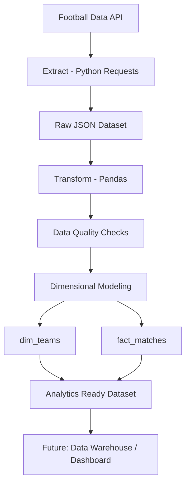

# Sports Data Pipeline ⚽

End-to-end data pipeline that extracts football match data from an external API, processes it and generates analytical datasets ready for data warehouse consumption.

This project demonstrates core concepts used in modern **data engineering workflows**, including ETL pipelines, dimensional data modeling, data quality validation, containerization and CI/CD automation.

---

# Data Pipeline Architecture



---

# Pipeline Flow

Football API  
↓  
Extract (Python)  
↓  
Raw Data (JSON)  
↓  
Transform (Pandas)  
↓  
Data Quality Validation  
↓  
Dimensional Data Modeling  
↓  
Analytics Ready Tables  

---

# Project Structure

```
sports-data-pipeline
│
├── data
│   ├── raw
│   ├── processed
│   └── metadata
│
├── pipelines
│   ├── run_pipeline.py
│   └── scheduler.py
│
├── src
│   ├── extract
│   │   └── extract_matches.py
│   │
│   ├── transform
│   │   ├── transform_matches.py
│   │   ├── dim_teams.py
│   │   └── fact_matches.py
│   │
│   ├── quality
│   │   └── data_checks.py
│   │
│   └── utils
│       └── incremental.py
│
├── Dockerfile
├── requirements.txt
└── README.md
```

---

# Features

## Data Extraction

The pipeline retrieves football match data from an external API using Python requests.

Example output:

```
raw_matches.json
```

---

## Data Transformation

Data is cleaned and structured using **Pandas**, generating a tabular dataset suitable for analytics.

Example output:

```
matches_clean.csv
```

---

## Data Quality Checks

Before generating analytical tables, the pipeline performs validation checks such as:

- dataset not empty
- null value detection
- score validation
- match status verification

These checks simulate real production data pipelines.

---

## Dimensional Data Modeling

The project implements a simplified **star schema** model.

Two analytical tables are generated:

### dim_teams

| team_id | team_name |
|------|------|
| 1 | Liverpool FC |
| 2 | Arsenal FC |

---

### fact_matches

| date | matchday | home_team_id | away_team_id | home_score | away_score |
|------|------|------|------|------|------|

This structure allows efficient analytics queries.

---

# Technologies Used

Python ecosystem:

- Python
- Pandas
- Requests

Data Engineering tools:

- Docker
- CI/CD
- GitHub Actions

Concepts implemented:

- ETL pipeline
- Data quality checks
- Dimensional modeling
- Containerization
- Continuous Integration

---

# Running the Pipeline

Install dependencies:

```
pip install -r requirements.txt
```

Run the pipeline:

```
python pipelines/run_pipeline.py
```

Expected output:

```
Iniciando pipeline

Dados extraídos com sucesso
Transformação concluída
Data quality checks passaram
dim_teams criada
fact_matches criada

Pipeline finalizado
```

---

# Running with Docker

Build container:

```
docker build -t sports-data-pipeline .
```

Run pipeline inside container:

```
docker run sports-data-pipeline
```

---

# Continuous Integration

The project includes automated CI/CD using GitHub Actions.

Every push to the repository automatically:

1. installs dependencies  
2. runs the pipeline  
3. validates the project structure  
4. builds the Docker container  

This simulates a real production deployment pipeline.

---

# Future Improvements

Possible extensions for the project:

- incremental data ingestion
- integration with a cloud data warehouse
- orchestration with Airflow
- dashboard visualization
- automated unit tests

---

# Author

Lincoln Gomes  

Data & Automation | Python | Data Pipelines | Analytics Engineering  

LinkedIn  
https://www.linkedin.com/in/lincoln-kaye-gomes-b89a44184
